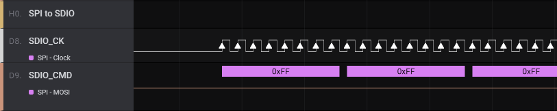
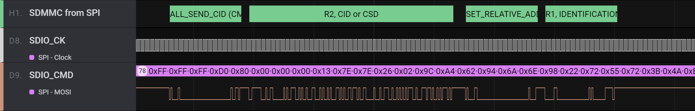

# SDMMC from SPI

This is a high-level analyzer (HLA) for decoding SD and MMC comminication with a Saleae logic analyzer.

The analyzer only works when using SD mode (CK/CMD/DATx) and is not compatible with communication in SPI mode.

## Setup

To use this extension, do the following:

### Install Saleae Logic 2

As of the time of writing, the latest version was v2.3.2.

### Install this extension

1. Download all files to a directory on your computer

2. In the "Extensions" tab, select "Create Extension" and select "Load existing extension."

3. Select the "extension.json" file on your computer.

### Create an SPI analyzer

1. MOSI mapped to SDIO_CMD
  
2. MISO unmapped
  
3. Clock mapped to SDIO_CK

4. Enable unmapped (important)
  
5. MSB first
  
6. 8 bits per transfer
  
7. CPOL = 0
  
8. CPHA = 0

### Create an "SDMMC from SPI" analyzer

Use the SPI analyzer above as the input.

## Example

The SPI analyzer should be outputting results similiar to the following:

Because of the way the analyzer works, you may need to trim your results such that SPI_SCK is low at the beginning of the capture.

When there is activity on the CMD line, the analyzer will output info about it.  The following shows the identification handshake between the host and the device.

## Notes

This extension is not compatible with Saleae Logic 1.x.

The SD and MMC protocols are very similar.  This analyzer is applicable to both.

The value of the CRC7 in commands and reponses is not checked.

The data lines are not decoded.
